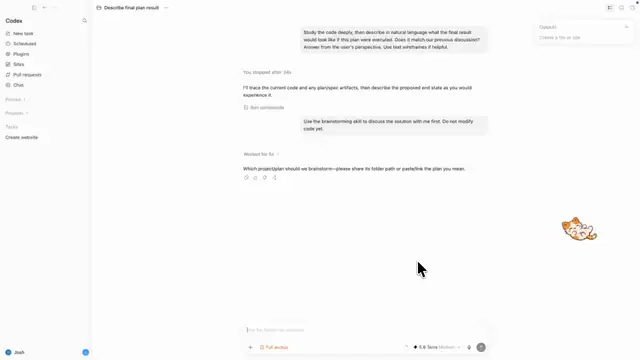
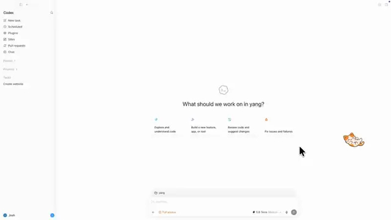
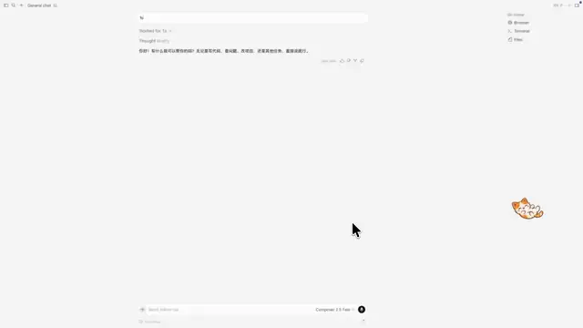
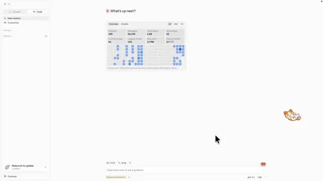
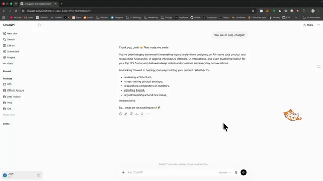
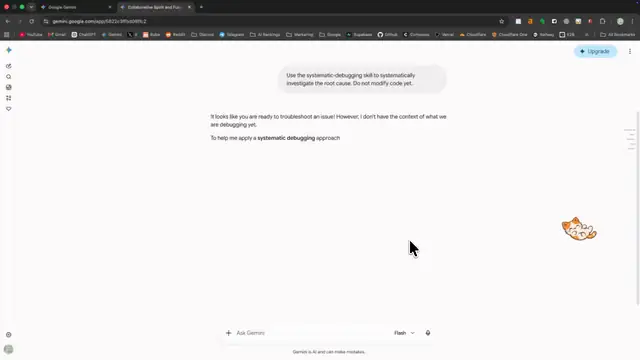
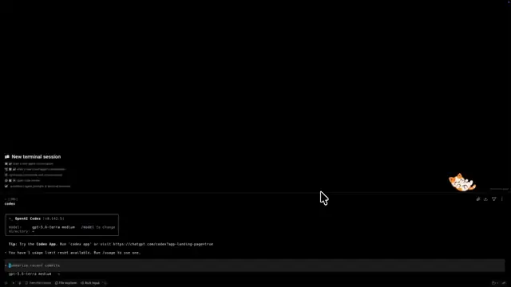

# Sleepy Cat

**مكتبة prompts الشخصية الخاصة بك.**

## العروض التوضيحية

تعمل المعاينات تلقائياً وبشكل متكرر. انقر على أي معاينة لفتح الفيديو بالدقة الكاملة.

| Codex App | مجموعات prompts في Codex |
| :---: | :---: |
| [](docs/codex-app-demo.mp4) | [](docs/codex-prompt-group-demo.mp4) |
| **Cursor App** | **Claude App** |
| [](docs/cursor-app-demo.mp4) | [](docs/claude-app-demo.mp4) |
| **ChatGPT Web** | **Gemini Web** |
| [](docs/chatgpt-web-demo.mp4) | [](docs/gemini-web-demo.mp4) |
| **CLI** | |
| [](docs/cli-demo.mp4) | |

**اقرأ هذا باللغة:** [English](README.md) | [简体中文](README.zh-CN.md) | [हिन्दी](README.hi.md) | [Español](README.es.md) | **العربية**

كل شخص يستحق مكتبة prompts شخصية.

Sleepy Cat هو مكتبة prompts محلية لتطبيقات سطح المكتب والطرفية وأدوات الذكاء الاصطناعي في المتصفح، بما فيها Codex وCursor وClaude وChatGPT وGemini وغيرها. اختر prompt محفوظاً، فيملؤه Sleepy Cat في حقل الإدخال النشط ويرسله بإجراء واحد. لا حاجة إلى النسخ واللصق والضغط على Return كل مرة. اختر **إدراج فقط** عندما تريد مراجعة المحتوى قبل الإرسال.

أنشئ مجموعات prompts لإرسال سلسلة من prompts بالترتيب.

## الاستخدام

1. أنشئ prompts مفردة ومجموعات prompts وتصنيفات في مكتبتك.
2. ضع المؤشر في حقل الإدخال الذي تريد العمل فيه.
3. افتح Sleepy Cat واختر prompt أو مجموعة.

## التنزيل

نزّل أحدث ملف DMG لأجهزة macOS Apple Silicon أو مثبت Windows x64 من [GitHub Releases](https://github.com/Imd11/sleepy-cat/releases/latest).

على macOS، يحتاج التطبيق إلى إذن Accessibility لإدراج prompts وإرسالها في التطبيقات المدعومة.

## مكتبة prompts الخاصة بك

يحفظ Sleepy Cat مكتبتك محلياً ولا يرفع محتوى prompts إلى خادم. استورد أو صدّر مكتبات JSON عندما تحتاج إلى نسخة احتياطية أو تريد نقل prompts.

تتوفر مكتبات مثال في:

- `examples/prompts/prompts-zh.json`
- `examples/prompts/prompts-en.json`

## التطوير

```bash
npm install
npm test
npm run tauri -- build
```

## الترخيص

MIT
