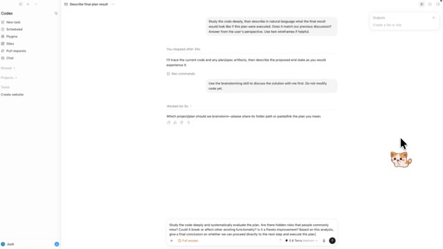
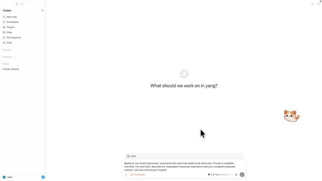
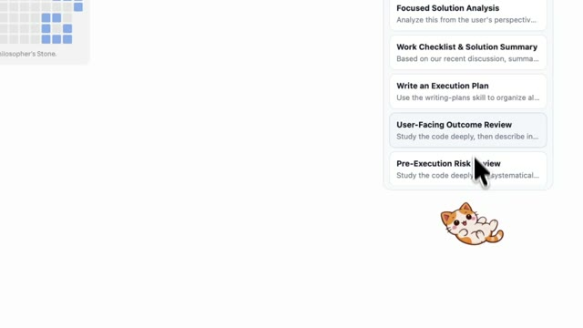
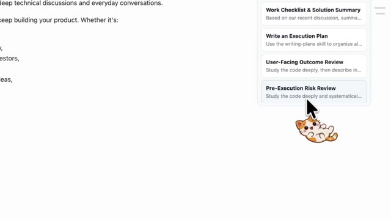
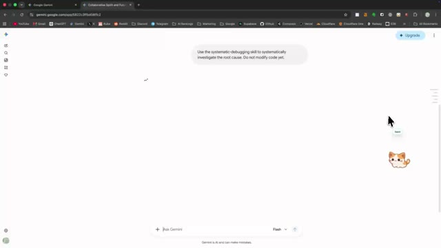

# Sleepy Cat

**आपकी निजी prompt library।**

## डेमो

वीडियो चलाने के लिए किसी preview पर क्लिक करें।

| Codex App | Codex Prompt Groups |
| :---: | :---: |
| [](docs/codex-app-demo.mp4) | [](docs/codex-prompt-group-demo.mp4) |
| **Cursor App** | **Claude App** |
| [](docs/cursor-app-demo.mp4) | [](docs/claude-app-demo.mp4) |
| **ChatGPT Web** | **Gemini Web** |
| [](docs/chatgpt-web-demo.mp4) | [](docs/gemini-web-demo.mp4) |
| **CLI** | |
| [](docs/cli-demo.mp4) | |

**इस भाषा में पढ़ें:** [English](README.md) | [简体中文](README.zh-CN.md) | **हिन्दी** | [Español](README.es.md) | [العربية](README.ar.md)

हर व्यक्ति अपने निजी prompt library का हकदार है।

Sleepy Cat desktop apps, terminals और browser-based AI tools के लिए एक local prompt library है, जिसमें Codex, Cursor, Claude, ChatGPT, Gemini और अन्य tools शामिल हैं। कोई saved prompt चुनें और Sleepy Cat उसे active input में भरकर एक ही action में भेज देता है। बार-बार copy, paste और Return दबाने की जरूरत नहीं। भेजने से पहले content देखना हो तो **Insert only** चुनें।

Prompt groups बनाकर prompts की एक sequence को क्रम से भेजें।

## इस्तेमाल

1. अपनी library में individual prompts, prompt groups और categories बनाएं।
2. जिस input में काम करना है, उस पर focus करें।
3. Sleepy Cat खोलें और कोई prompt या group चुनें।

## डाउनलोड

[GitHub Releases](https://github.com/Imd11/sleepy-cat/releases/latest) से नवीनतम macOS Apple Silicon DMG या Windows x64 installer डाउनलोड करें।

macOS पर supported apps में prompts insert और send करने के लिए Accessibility permission चाहिए।

## आपकी prompt library

Sleepy Cat आपकी library को local रूप से store करता है और prompt content किसी server पर upload नहीं करता। Backup बनाने या prompts को दूसरी जगह ले जाने के लिए JSON libraries import या export करें।

Example libraries यहाँ उपलब्ध हैं:

- `examples/prompts/prompts-zh.json`
- `examples/prompts/prompts-en.json`

## Development

```bash
npm install
npm test
npm run tauri -- build
```

## License

MIT
